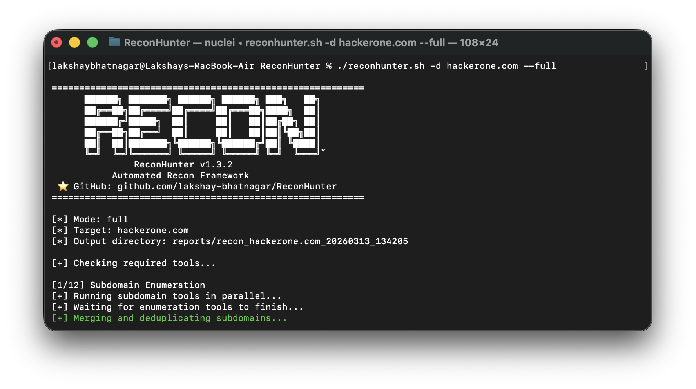
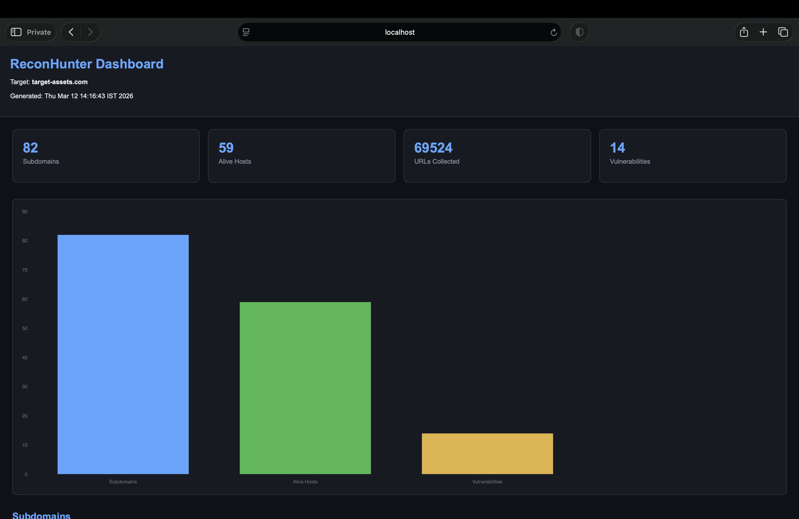
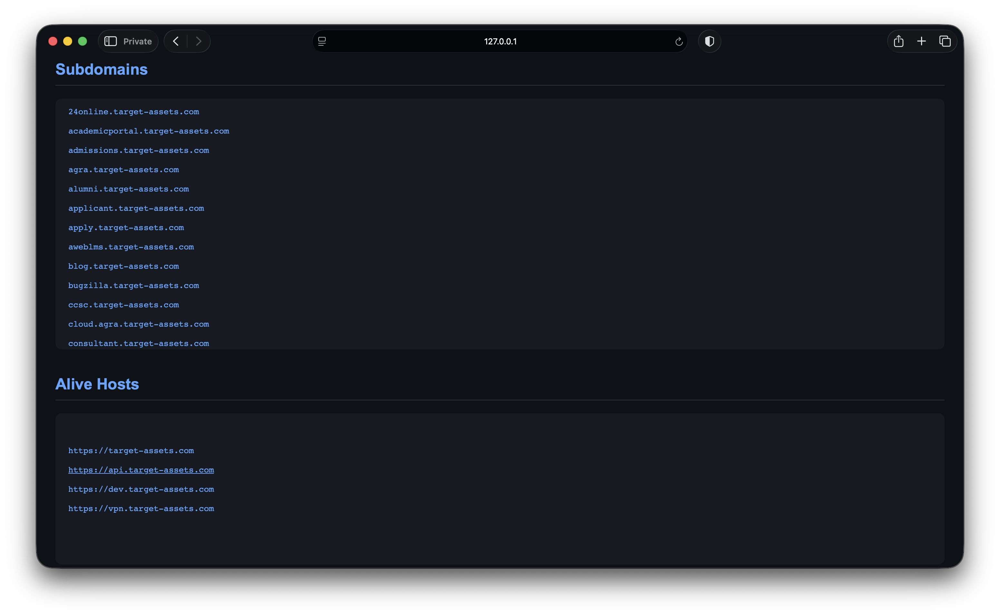
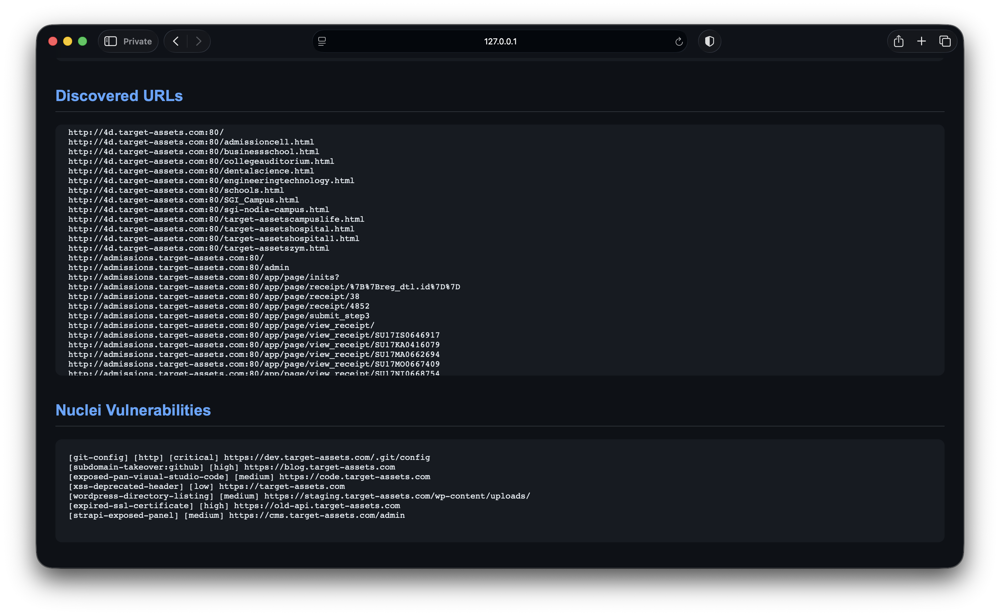

# ReconHunter 🔍
      



**ReconHunter** is a lightweight, cross-platform automated reconnaissance framework. It now supports macOS (Intel & Apple Silicon) and Linux natively, eliminating the need for heavy virtualization or dedicated VMs.
The goal of ReconHunter is to help security researchers, penetration testers, and bug bounty hunters quickly gather attack surface information and identify potential vulnerabilities in target domains.

---

## 🚀 Features

ReconHunter automates the entire reconnaissance workflow:

### 🔎 Subdomain Enumeration

* Enumerates subdomains using multiple tools in parallel
* Aggregates and deduplicates results

Tools used:

* Subfinder
* Assetfinder
* Findomain
* Amass
* crt.sh certificate transparency logs

---

### 🌐 DNS Resolution

* Resolves discovered subdomains to identify active hosts
* Filters dead domains to reduce noise

---

### 🔓 Port Scanning

* Performs automated network port scanning
* Identifies open services on discovered hosts

Powered by:

* Nmap

---

### 🔗 HTTP Service Discovery

* Detects live web services on discovered hosts

Powered by:

* httpx

---

### 🧠 Technology Detection

* Identifies technologies used by target websites

Powered by:

* WhatWeb

Example detections:

* Web frameworks
* CMS platforms
* JavaScript libraries
* Server technologies

---

### 📸 Screenshot Automation

* Captures screenshots of all discovered web services

Powered by:

* Gowitness

This helps researchers quickly visually inspect targets.

---

### 📦 URL Collection

* Collects historical and archived URLs from multiple sources

Sources:

* gau
* waybackurls

This helps uncover hidden endpoints and legacy functionality.

---

### 🔑 Parameter Discovery

* Identifies potential parameters for testing injection vulnerabilities

Powered by:

* Arjun

---

### 📂 Directory Bruteforcing

* Performs content discovery on discovered web services

Powered by:

* ffuf

---

### 🛡 Vulnerability Scanning

* Scans discovered endpoints for known vulnerabilities

Powered by:

* Nuclei

---

### 📊 HTML Security Report

ReconHunter generates a structured **HTML report** including:




* Subdomains discovered
* Alive hosts
* URLs collected
* Detected technologies
* Vulnerabilities discovered

The report is designed for quick security assessment and documentation.

---

## ⚙️ Recon Pipeline

The automated reconnaissance workflow:

```
Subdomain Enumeration
        ↓
HTTP Service Discovery
        ↓
DNS Resolution
        ↓
Port Scanning
        ↓
Technology Detection
        ↓
Screenshot Capture
        ↓
URL Collection
        ↓
Parameter Discovery
        ↓
Directory Bruteforcing
        ↓
Vulnerability Scanning
        ↓
Report Generation
```

---

## 🧩 Modes

ReconHunter supports multiple scanning modes:

### Fast Mode

Quick reconnaissance for rapid attack surface discovery.

Includes:

* Subdomain enumeration
* HTTP probing
* DNS resolution
* URL gathering
* Nuclei scanning
* Report generation

```
reconhunter -d example.com --fast
```

---

### Full Mode

Complete reconnaissance pipeline including all features.

```
reconhunter -d example.com --full
```

---

### Scan Mode

Runs vulnerability scanning on existing discovered assets.

```
reconhunter -d example.com --scan
```

---

## 📂 Project Structure

```
ReconHunter
│
├── reconhunter.sh        # Main automation script
├── config.yaml           # Configuration file
├── README.md             # Project documentation
│
└── reports
    └── recon_target_timestamp
        ├── all_subdomains.txt
        ├── alive_http.txt
        ├── all_urls.txt
        ├── nuclei_output.txt
        ├── whatweb.txt
        ├── screenshots/
        ├── recon.log
        └── report.html
```

---

## 🛠 Installation

ReconHunter features a smart installer that automatically detects your OS and sets up the environment.

### Prerequisites
* **Linux:** `sudo` privileges.
* **macOS:** [Homebrew](https://brew.sh/) installed.

### Automated Setup
```bash
chmod +x install.sh
./install.sh
```
This installs required tools such as:

* subfinder
* assetfinder
* httpx
* dnsx
* nuclei
* ffuf
* amass
* gowitness
* jq
* curl
* nmap
* gau
* whatweb

---

## 📌 Usage

Basic usage:

```
./reconhunter.sh -d example.com --full
```

Custom output directory:

```
./reconhunter.sh -d example.com --full -o results
```

Active Enumeration Scanning:

```
./reconhunter.sh -d example.com --fast --active
```

Display help:

```
./reconhunter.sh --help
```

Display version

```
./reconhunter.sh --version
```

---

## ⚙️ Configuration

ReconHunter uses a configurable YAML file.

Example:

```
config.yaml
```

This allows customization of:

* wordlists
* thread count
* screenshot settings
* vulnerability severity levels
* report generation
* tool configuration

---

## 📊 Example Output

After running ReconHunter, results are stored in:

```
reports/recon_example.com_timestamp/
```

Including:

* Subdomains discovered
* Active web services
* Historical URLs
* Technology fingerprinting
* Vulnerability scan results
* Automated HTML report

---

## 🔒 Use Cases

ReconHunter can be used for:

* Bug bounty reconnaissance
* Web application penetration testing
* Attack surface mapping
* Security assessments
* Automated reconnaissance pipelines

---

## 👨‍💻 Author

Lakshay Bhatnagar

Cybersecurity enthusiast focused on:

* Web application security
* Penetration testing
* Bug bounty hunting
* Security automation

---

## ⚠️ Disclaimer

This tool is intended for **educational and authorized security testing purposes only**.

Do not use ReconHunter on systems without proper authorization.

The author is not responsible for any misuse.

---
